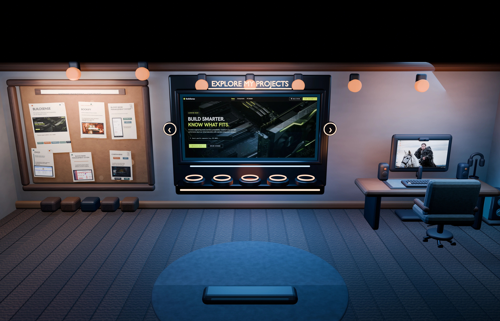
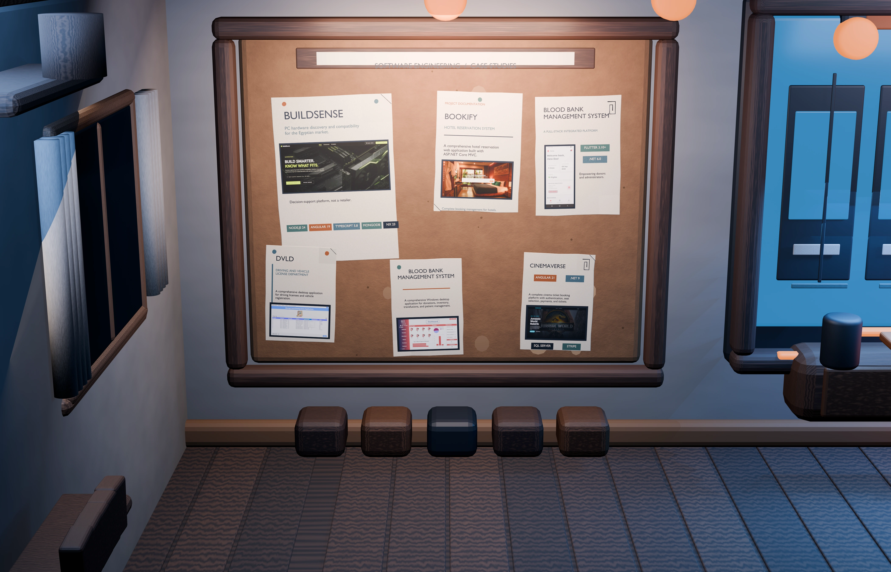
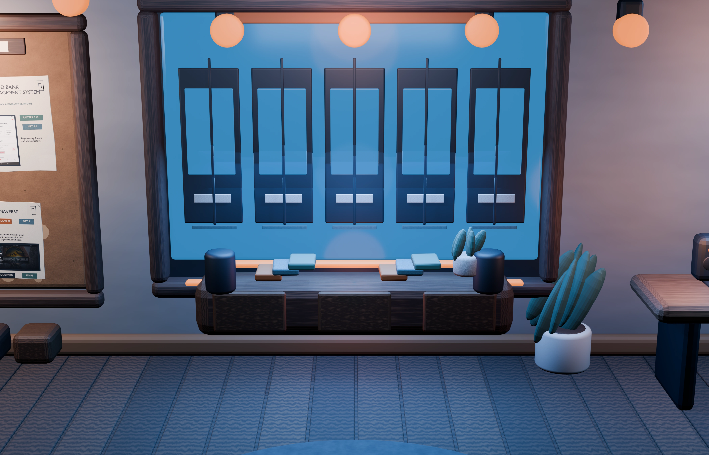

<div align="center">

# Nour Eldeen Dev

### A cinematic, bilingual software engineering portfolio

[](https://www.noureldeendev.me/en)

[](https://www.noureldeendev.me/en)

</div>

## The Experience

An interactive engineering room that presents projects, case studies, media, and learning artifacts through three focused paths.

|                                                  Hire                                                  |                                                   Watch                                                   |                                                   Learn                                                   |
| :----------------------------------------------------------------------------------------------------: | :-------------------------------------------------------------------------------------------------------: | :-------------------------------------------------------------------------------------------------------: |
| [](https://www.noureldeendev.me/en/hire) | [](https://www.noureldeendev.me/en/watch) | [](https://www.noureldeendev.me/en/learn) |
|                                       Projects and case studies                                        |                                          Visual project stories                                           |                                       Tools and learning artifacts                                        |

## Built With

`Next.js 16` | `React 19` | `TypeScript` | `Three.js` | `React Three Fiber` | `GSAP` | `next-intl` | `Tailwind CSS 4`

## Run Locally

Requires Node.js 24 and npm 11.

```bash
npm install
npm run dev
```

Open [http://localhost:3000](http://localhost:3000).

## Quality Checks

```bash
npm run lint
npm run typecheck
npm test
npm run build
```

---

<div align="center">

English | Arabic | RTL | Responsive | Reduced-motion aware

</div>
