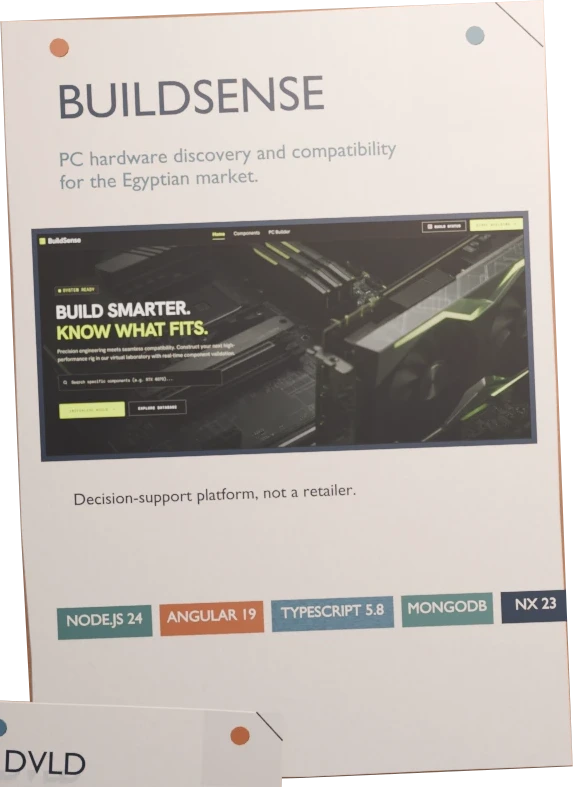
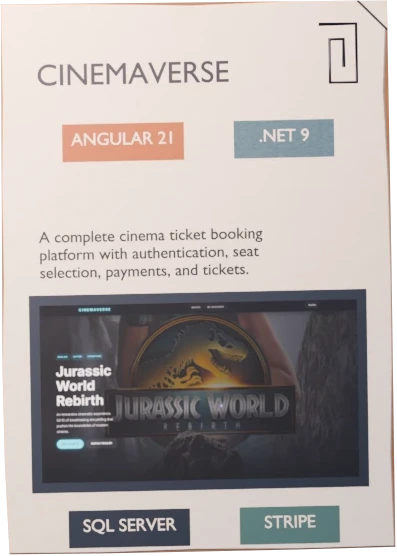
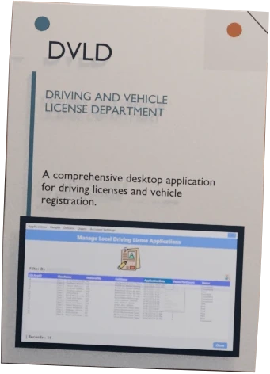

# Nour Eldeen Dev

### A cinematic, bilingual software engineering portfolio

## The Experience

Nour Eldeen Dev turns a traditional portfolio into an interactive engineering room. The experience brings together software projects, detailed case studies, project media, certificates, tools, and learning artifacts without losing the clarity of a professional portfolio.

Visitors can enter through three focused paths, each presenting the same verified work from a different perspective.

|                                                  Hire                                                  |                                                   Watch                                                   |                                                   Learn                                                   |
| :----------------------------------------------------------------------------------------------------: | :-------------------------------------------------------------------------------------------------------: | :-------------------------------------------------------------------------------------------------------: |
|  |  |  |
|                                       Projects and case studies                                        |                                          Visual project stories                                           |                                       Tools and learning artifacts                                        |

### Hire

A direct route through selected projects and engineering case studies, with clear context, constraints, decisions, evidence, and reflections.

### Watch

A media-led view of the work for visitors who want to understand projects through demos, visual stories, and interaction.

### Learn

A desktop-inspired workspace containing certificates, software tools, learning resources, and technical artifacts.

## Featured Case Studies

|                                                          BuildSense                                                          |                                                           CinemaVerse                                                           |                                                    DVLD                                                    |
| :--------------------------------------------------------------------------------------------------------------------------: | :-----------------------------------------------------------------------------------------------------------------------------: | :--------------------------------------------------------------------------------------------------------: |
|  |  |  |

## Design Principles

- **Cinematic storytelling:** motion and transitions guide attention instead of acting as decoration.
- **Multiple ways to explore:** Hire, Watch, and Learn adapt the presentation while keeping the underlying facts consistent.
- **Bilingual by design:** English and Arabic are first-class experiences with proper RTL layout.
- **Accessible motion:** system and manual reduced-motion preferences are respected.
- **Responsive interaction:** the full experience remains available across desktop and mobile layouts.
- **Evidence over claims:** project pages connect decisions and outcomes to real media and artifacts.

## Technology

`Next.js 16` | `React 19` | `TypeScript` | `Three.js` | `React Three Fiber` | `GSAP` | `next-intl` | `Tailwind CSS 4`

The interface combines server-rendered Next.js routes with localized content, Three.js scenes, GSAP motion, responsive layouts, and generated SEO metadata. The production site is deployed on Vercel under its own domain.

---

English | Arabic | RTL | Responsive | Reduced-motion aware

