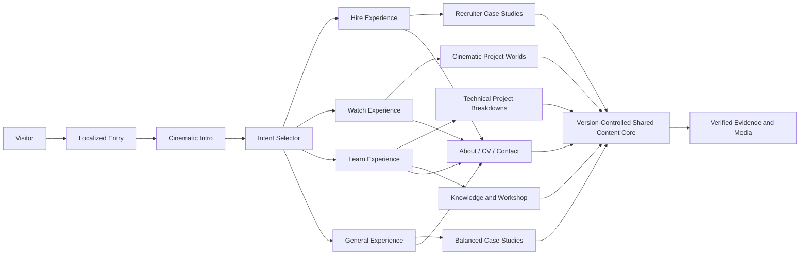
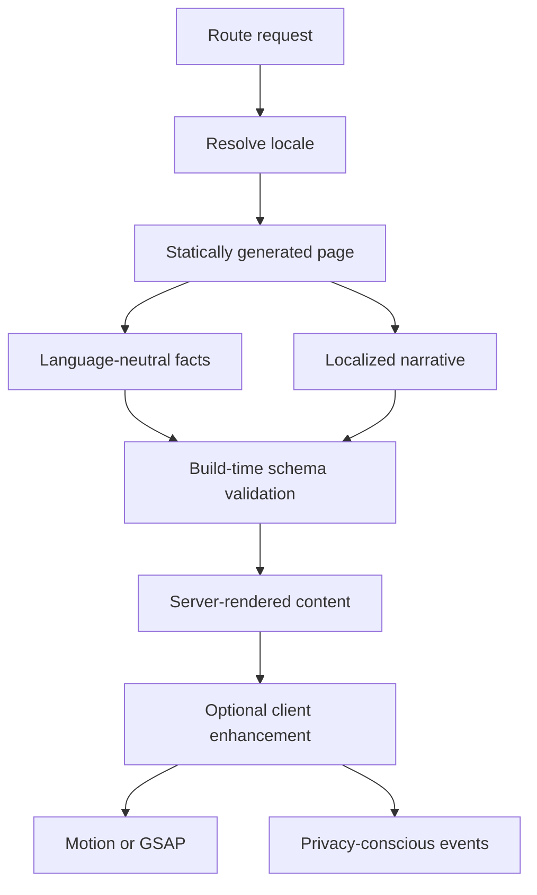
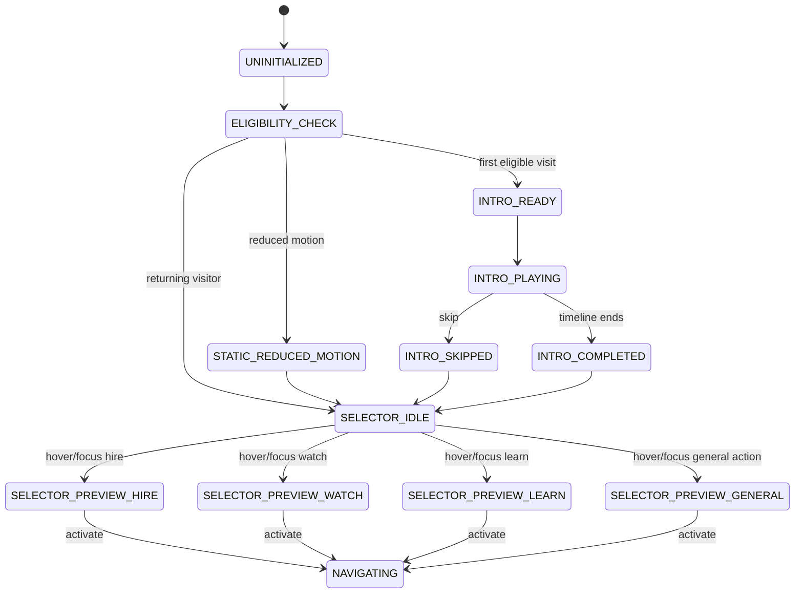
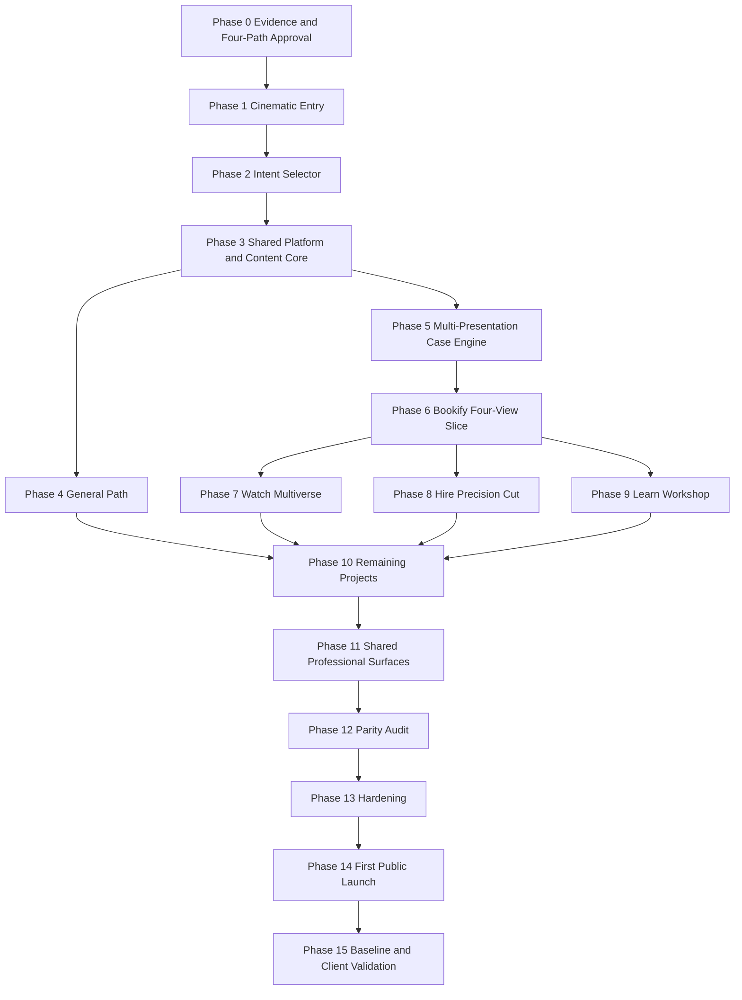

# Portfolio Technical Design Document and Implementation Plan

## 1. Document Purpose

> **Implementation authority:** Nour approved TDD v1.1 on 2026-07-21. Phase 0 is accepted as complete by owner decision, and Phase 1 may proceed despite the earlier conditional content gate. The confirmed visual allocation, stack, repository initialization, package manager, Node baseline, four-path contract, and approved entry copy are recorded in `docs/05 Decision Register.md` (D-044 through D-048).

This document defines the technical architecture, implementation boundaries, interaction behavior, content model, testing strategy, quality gates, and phased delivery plan for Nour Eldeen Mahmoud's portfolio.

It converts the product strategy and experience requirements into an implementation-ready system. It is intentionally more specific than the PRD and experience architecture documents.

The document covers the complete first public release:

- Cinematic introduction.
- Optional intent selector with three primary choices: `Hire`, `Watch`, and `Learn`.
- A public `General` path for visitors who skip intent selection or want a balanced overview.
- Complete Hire experience for recruiters and hiring decision-makers.
- Complete Watch experience for visitors who came specifically to see Nour's work through a cinematic project multiverse.
- Complete Learn experience for visitors who want technical depth, knowledge, process, and a personal engineering workshop.
- Five evidence-backed flagship project case studies presented through shared facts and path-specific views.
- English and Arabic routes with full LTR and RTL behavior.
- Knowledge, About, CV, and contact surfaces.
- Accessibility, performance, analytics, SEO, testing, and deployment.

All four public paths are first-release scope. They are delivered in separate implementation phases, but the first public launch is blocked until `General`, `Hire`, `Watch`, and `Learn` are complete. A future Client/Solutions path is architecturally supported but is not part of the first release.

---

## 2. Executive Technical Decision

### 2.1 Selected visual and interaction direction

This TDD treats the selected working direction as:

> **Cinematic Systems** — evidence-first engineering presented through controlled cinematic storytelling.

The direction combines:

- **Cinematic Product Stories** for pacing, project-specific chapters, directed media, typography, and transitions.
- **Living Systems Lab** for architecture diagrams, workflows, system states, decisions, and backend credibility.
- A limited **Project Multiverse** layer in which each project receives a distinct accent, motion motif, and visual grammar without becoming an independently engineered website.

### 2.2 Visual allocation

The implementation should behave approximately as follows:

- 60% cinematic product storytelling.
- 30% systems and evidence visualization.
- 10% project-specific world building.

### 2.3 Core visual thesis

The repeated visual transformation is:

```text
Complexity
→ constraints
→ system structure
→ data or user flow
→ decision
→ validation
→ useful outcome
```

Animation must reinforce this transformation. Decorative effects that do not explain, transition, prioritize, or reward are excluded.

### 2.4 First-release experience scope

The first release includes four complete public experiences:

1. **Hire** — a recruiter-focused, evidence-first route optimized for role fit, contribution, `.NET` depth, CV, and contact.
2. **Watch** — a media-forward cinematic route for visitors who came to watch Nour's work, project worlds, workflows, and signature moments.
3. **Learn** — a personal engineering workshop focused on architecture, decisions, experiments, tutorials, knowledge collections, and how Nour learns and validates.
4. **General** — a balanced public overview for visitors who skip the selector, arrive without a specific intent, or want the complete portfolio without a strongly specialized presentation.

The entry selector promotes `Hire`, `Watch`, and `Learn` as the three primary intent choices. `General` remains a visible secondary action and the default continuation path when the visitor skips intent selection.

The four experiences reuse one factual and evidence source. They may differ in hierarchy, copy depth, navigation, motion grammar, media emphasis, and case-study presentation, but they must never contradict one another.

---

## 3. Goals and Non-Goals

## 3.1 Technical goals

The system must:

- Make `.NET backend/full-stack` the professional center.
- Reuse one verified factual source across General, Hire, Watch, and Learn experiences.
- Support English and Arabic with equivalent facts and actions.
- Deliver a rich desktop experience and a complete simplified mobile experience.
- Keep essential content available when animation, advanced graphics, JavaScript enhancements, or media fail.
- Support five complete flagship case studies without page-specific hardcoding.
- Allow new projects and knowledge collections to be added through content files.
- Meet WCAG 2.2 AA as the accessibility target.
- Target Good Core Web Vitals.
- Use zero-cost or free-tier infrastructure and open-source assets.
- Remain statically deployable or server-optional.

## 3.2 Non-goals for the first release

The first release does not include:

- A dedicated Client/Solutions sales experience.
- Any incomplete or placeholder public path.
- Interactive AI CV.
- Gamification, progress systems, collectibles, or unlocks.
- A terminal-based navigation system.
- A fake operating system interface.
- A WebGL arcade.
- Embedded Unity builds on initial page load.
- A public CMS or admin dashboard.
- User accounts.
- A custom backend.
- Session recording analytics.
- Autoplay audio.
- A mandatory intent choice that blocks the General path or direct routes.
- A 3D orb, galaxy, or generic particle field as the central identity.

---

## 4. System Context



The site is a static-first content product. There is no required application server or database in the first release.

`General`, `Hire`, `Watch`, and `Learn` are public presentations. The **Shared Content Core** is internal architecture, not a fifth visitor-facing path.

---

## 5. Proposed Technology Stack

The exact package versions must be pinned at implementation kickoff. The architecture should not depend on an unreleased feature or a provider-specific runtime.

## 5.1 Application framework

- Next.js App Router.
- React.
- TypeScript with strict mode.
- Static generation for public routes.
- Server Components by default.
- Client Components only where interaction or browser state is required.

### Rationale

The portfolio requires:

- Language-prefixed routes.
- Separate project pages.
- Experience-specific project pages.
- Route metadata.
- Static generation.
- Image handling.
- Progressive enhancement.
- Future knowledge expansion.

## 5.2 Styling

Use a controlled hybrid:

- CSS custom properties for design tokens.
- Tailwind CSS for layout, spacing, responsive utilities, and accessibility utilities.
- CSS Modules for complex visual scenes, project-specific treatments, and animation layers.

Rules:

- Do not place project identity colors directly inside components.
- Do not use arbitrary values when a token exists.
- Do not create a unique layout system for every project.
- Complex selectors must remain local to a CSS Module.

## 5.3 Motion

Use two tools with strict ownership boundaries:

### Motion

Use for:

- Buttons and card interaction.
- Path preview changes.
- Route transitions.
- Section reveal.
- Small layout transitions.
- Reduced-motion aware component variants.

### GSAP

Use only for:

- Cinematic introduction timeline.
- The transition from the intro into the intent selector.
- A maximum of two high-value scroll-choreographed scenes on any route.

Rules:

- The same element must not be controlled by Motion and GSAP simultaneously.
- GSAP timelines must be created inside scoped contexts and killed on unmount.
- Continuous animation loops require explicit product justification.
- No smooth-scroll library is included by default.
- Native scroll remains the default.

## 5.4 Content

Use version-controlled local content.

Recommended structure:

- TypeScript for language-neutral facts, evidence status, links, IDs, media metadata, and project structure.
- MDX or structured localized files for long English and Arabic narrative sections.
- Zod schemas for build-time validation.

No external CMS is required.

## 5.5 Internationalization

Use locale-prefixed routing and an established App Router-compatible i18n library, with `next-intl` as the working recommendation.

The i18n implementation must support:

- `/en/` and `/ar/` routes.
- Static generation.
- Locale-aware metadata.
- Full `dir="ltr"` and `dir="rtl"` behavior.
- Locale-aware numbers and dates where used.
- Equivalent route switching.

## 5.6 Testing

- Vitest for unit tests.
- React Testing Library for components.
- Playwright for end-to-end and visual checks.
- axe integration for automated accessibility checks.
- Lighthouse CI or an equivalent automated performance audit.

## 5.7 Analytics

Use a provider-neutral event adapter.

The initial implementation must support a privacy-conscious free analytics provider without:

- Session replay.
- User fingerprinting.
- Form-content capture.
- Personal data in event payloads.

## 5.8 Hosting

The application must be deployable to a zero-cost static or hybrid host.

The final provider remains an infrastructure decision, but the application must not require:

- A paid domain.
- A paid CMS.
- A paid database.
- Long-running server processes.

---

## 6. Repository and Folder Architecture

```text
portfolio/
├── app/
│   ├── page.tsx
│   ├── not-found.tsx
│   ├── sitemap.ts
│   ├── robots.ts
│   └── [lang]/
│       ├── layout.tsx
│       ├── page.tsx
│       ├── general/
│       │   └── page.tsx
│       ├── hire/
│       │   ├── page.tsx
│       │   └── projects/[slug]/page.tsx
│       ├── watch/
│       │   ├── page.tsx
│       │   └── projects/[slug]/page.tsx
│       ├── learn/
│       │   ├── page.tsx
│       │   ├── projects/[slug]/page.tsx
│       │   └── tutorials/[slug]/page.tsx
│       ├── projects/[slug]/page.tsx
│       ├── knowledge/page.tsx
│       └── about/page.tsx
├── components/
│   ├── entry/
│   │   ├── cinematic-intro.tsx
│   │   ├── intro-scene.tsx
│   │   ├── intro-skip.tsx
│   │   ├── engineering-core.tsx
│   │   └── intent-selector.tsx
│   ├── experiences/
│   │   ├── general/
│   │   ├── hire/
│   │   ├── watch/
│   │   └── learn/
│   ├── navigation/
│   ├── project/
│   ├── case-study/
│   ├── evidence/
│   ├── media/
│   ├── diagrams/
│   ├── knowledge/
│   ├── workshop/
│   ├── about/
│   ├── analytics/
│   └── ui/
├── content/
│   ├── profile/
│   │   ├── facts.ts
│   │   ├── en.ts
│   │   └── ar.ts
│   ├── experiences/
│   │   ├── general/
│   │   ├── hire/
│   │   ├── watch/
│   │   └── learn/
│   ├── projects/
│   │   ├── buildsense/
│   │   │   ├── facts.ts
│   │   │   ├── en.mdx
│   │   │   └── ar.mdx
│   │   ├── bookify/
│   │   ├── blood-bank/
│   │   ├── how-to-train-your-ai/
│   │   └── cinemaverse/
│   ├── knowledge/
│   ├── tutorials/
│   └── navigation/
├── lib/
│   ├── content/
│   ├── experiences/
│   ├── i18n/
│   ├── analytics/
│   ├── motion/
│   ├── media/
│   ├── seo/
│   ├── accessibility/
│   └── validation/
├── styles/
│   ├── tokens.css
│   ├── typography.css
│   ├── reset.css
│   ├── motion.css
│   └── globals.css
├── public/
│   ├── media/
│   │   ├── entry/
│   │   └── projects/
│   ├── cv/
│   ├── social/
│   └── icons/
├── scripts/
│   ├── validate-content.ts
│   ├── validate-locales.ts
│   ├── validate-media.ts
│   ├── validate-experience-parity.ts
│   └── generate-social-images.ts
└── tests/
    ├── unit/
    ├── component/
    ├── e2e/
    ├── visual/
    └── accessibility/
```

---

## 7. Route Architecture

| Route                            | Purpose                                                               | Intro behavior    |
| -------------------------------- | --------------------------------------------------------------------- | ----------------- |
| `/`                              | Detect or suggest browser language and redirect.                      | No intro.         |
| `/{lang}`                        | Cinematic intro and intent selector.                                  | Eligible to play. |
| `/{lang}/general`                | Balanced general portfolio path.                                      | Never autoplay.   |
| `/{lang}/hire`                   | Recruiter and hiring path.                                            | Never autoplay.   |
| `/{lang}/watch`                  | Cinematic work-showcase path for visitors who came to watch the work. | Never autoplay.   |
| `/{lang}/learn`                  | Personal engineering workshop and learning path.                      | Never autoplay.   |
| `/{lang}/projects/{slug}`        | Canonical balanced project case study.                                | Never autoplay.   |
| `/{lang}/hire/projects/{slug}`   | Concise role-focused project presentation.                            | Never autoplay.   |
| `/{lang}/watch/projects/{slug}`  | Media-forward cinematic project chapter.                              | Never autoplay.   |
| `/{lang}/learn/projects/{slug}`  | Architecture, decision, validation, and reflection breakdown.         | Never autoplay.   |
| `/{lang}/learn/tutorials/{slug}` | How-I-Work or technical tutorial.                                     | Never autoplay.   |
| `/{lang}/knowledge`              | Curated knowledge library.                                            | Never autoplay.   |
| `/{lang}/about`                  | About, evidence-mapped capabilities, CV, and contact.                 | Never autoplay.   |

## 7.1 Route rules

- All public content uses `en` or `ar` prefixes.
- Direct routes bypass the intro and selector.
- Returning to the selector is an explicit navigation action.
- The language switch attempts to preserve the current path, project slug, and reading position.
- Invalid localized slugs return a useful localized not-found page.
- `General` is a real public route, not only an internal fallback.
- The entry page presents `Hire`, `Watch`, and `Learn` as primary choices and `Continue to General` as a secondary choice.
- Skipping intent selection or choosing the neutral continuation opens `/{lang}/general`.
- All project views resolve to the same `ProjectFacts` and evidence records.
- A future Client/Solutions route is not created until its content and experience are complete.

---

## 8. Runtime Architecture



The site must remain readable before optional client enhancement completes.

---

## 9. Entry Experience State Machine

## 9.1 States

```text
UNINITIALIZED
ELIGIBILITY_CHECK
STATIC_REDUCED_MOTION
INTRO_READY
INTRO_PLAYING
INTRO_SKIPPED
INTRO_COMPLETED
SELECTOR_IDLE
SELECTOR_PREVIEW_HIRE
SELECTOR_PREVIEW_WATCH
SELECTOR_PREVIEW_LEARN
SELECTOR_PREVIEW_GENERAL
NAVIGATING
```

## 9.2 State transitions



## 9.3 Persistence keys

```text
portfolio.intro.seen.v2
portfolio.locale.v1
portfolio.intent.lastSelected.v1
```

Optional session-only values:

```text
portfolio.entry.replayed
portfolio.selector.lastPreview
```

## 9.4 Eligibility algorithm

```text
If the route is not /{lang}, do not play.
If prefers-reduced-motion is reduce, show static entry.
If replay query or Replay action is present, play.
If intro seen key is true, show selector.
Otherwise play intro.
```

## 9.5 Intro completion behavior

Both natural completion and Skip:

- Set the seen key.
- Move focus to the intent selector heading.
- Keep the URL unchanged.
- Do not reload the page.
- Do not automatically choose an intent.

Replay:

- Plays without clearing the stored seen state.
- Returns to the selector when complete.

## 9.6 Page visibility behavior

If the page becomes hidden during the intro:

- Pause the timeline.
- If hidden for a long interruption, complete the intro on return rather than forcing the visitor to watch from the start.

---

## 10. Cinematic Intro Technical Design

## 10.1 Concept

Internal scene name:

> **Engineering Core Assembly**

Narrative:

```text
Problem signals
→ pattern discovery
→ engineering core assembly
→ identity and positioning
→ three intent tracks emerge
→ General remains the neutral continuation
```

## 10.2 Duration targets

- Desktop: approximately 4.2–5.2 seconds.
- Mobile: approximately 2.8–3.6 seconds.
- Reduced motion: no timeline; identity and selector appear directly.

## 10.3 Desktop scene timeline

|         Time | Scene             | Visual behavior                                                                                                     |
| -----------: | ----------------- | ------------------------------------------------------------------------------------------------------------------- |
|     0–900 ms | Signal detection  | Booking, payment, hardware, healthcare, cross-platform, and interactive problem signals appear.                     |
|  900–2100 ms | Pattern discovery | Lines connect signals toward the center. Understand, Design, Build, Validate appear.                                |
| 2100–3300 ms | Core assembly     | The engineering core locks into a stable composition.                                                               |
| 3300–4100 ms | Identity reveal   | Name, `.NET-centered software engineer`, and core message appear.                                                   |
| 4100–5200 ms | Intent emergence  | The core generates Hire, Watch, and Learn tracks; a restrained General continuation settles beneath or around them. |

## 10.4 Scene layers

```text
Entry root
├── semantic identity layer
├── problem-signal layer
├── connection SVG layer
├── engineering-core SVG layer
├── intent-track layer
│   ├── hire track
│   ├── watch track
│   ├── learn track
│   └── general continuation
├── skip control
└── accessibility announcements
```

## 10.5 Rendering strategy

Initial implementation:

- HTML text.
- SVG lines and nodes.
- CSS gradients and restrained noise texture.
- GSAP transforms, opacity, masks, and SVG stroke animation.

Explicitly excluded from the initial entry:

- Three.js.
- Canvas particle systems.
- Shader effects.
- Video backgrounds.
- Audio.

## 10.6 Semantic strategy

- The name and professional role exist in the DOM before animation starts.
- Decorative duplicate words and lines use `aria-hidden="true"`.
- The Skip button is the first focusable control.
- The intro does not create fake system data.
- The screen reader receives a concise static identity, not every animated label.
- Hire, Watch, Learn, and General are available as real links in the fallback markup.

## 10.7 Responsive reduction

Desktop:

- Full distributed signal map.
- Central engineering core.
- Three primary intent tracks.
- General continuation placed as a quieter secondary route.

Mobile:

- Three representative problem signals only.
- Simplified central SVG.
- Shortened identity reveal.
- Vertical stack: Hire, Watch, Learn, then General.

Reduced motion:

- Static name and positioning.
- Static engineering-core mark.
- Intent selector visible immediately.

## 10.8 Intro failure fallback

If the animation script fails:

- The semantic identity remains visible.
- All four public routes remain accessible through no-JS or hydration fallback links.
- Skip is unnecessary but must not block interaction.

---

## 11. Intent Selector Technical Design

## 11.1 Information architecture

The selector presents three primary intent routes and one neutral general route.

### Hire

```text
Hire
I am evaluating Nour for a role, internship, or engineering opportunity.
```

Presentation destination:

```text
Recruiter Precision Cut
```

### Watch

```text
Watch
I came to watch Nour's work, projects, interactions, and visual product stories.
```

Presentation destination:

```text
Cinematic Project Multiverse
```

`Watch` does not mean a passive video-only page. It is a media-forward, explorable showcase whose main purpose is to let the visitor see the work quickly and memorably.

### Learn

```text
Learn
I want to understand Nour's architecture, decisions, experiments, knowledge, and working process.
```

Presentation destination:

```text
Personal Engineering Workshop
```

### General

```text
Continue to the general portfolio
A balanced overview of work, process, knowledge, About, CV, and contact.
```

`General` is a public path and the default continuation when the visitor does not select a specialized intent.

## 11.2 Semantic structure

```html
<nav aria-labelledby="intent-selector-title">
  <a href="/{lang}/hire">...</a>
  <a href="/{lang}/watch">...</a>
  <a href="/{lang}/learn">...</a>
  <a href="/{lang}/general">...</a>
</nav>
```

Do not use clickable `div` elements.

## 11.3 Desktop layout

Default:

- Engineering Core remains visible as the shared origin.
- Hire, Watch, and Learn occupy three balanced intent regions.
- General appears as a quieter but clearly visible secondary action.
- All titles and concise descriptions remain readable without hover.

Hire preview:

- Region expands or gains priority without hiding the other choices.
- Project evidence aligns into a precise grid.
- Bookify, Blood Bank, and CinemaVerse appear.
- `.NET`, APIs, payments, teamwork, CV, and contact become supporting labels.

Watch preview:

- The five project nodes separate into distinct tracks or worlds.
- Directed media fragments, project accents, and signature motifs appear.
- The preview communicates “see the work” rather than “read a résumé.”
- Evidence labels remain visible so spectacle does not replace credibility.

Learn preview:

- The engineering core transforms into an organized workshop or lab.
- Architecture diagrams, ADRs, tests, tutorials, knowledge collections, experiments, and reflections surface.
- The preview must feel structured, not like a scrapbook or operating-system desktop.

General preview:

- The core settles into a balanced editorial composition.
- Work, process, knowledge, About, CV, and contact receive equal but hierarchical access.
- Motion is restrained and neutral.

## 11.4 Interaction inputs

- Pointer hover.
- Keyboard focus.
- Touch activation.
- Enter and Space where appropriate.

Focus behavior must provide the same information as hover.

## 11.5 Route transition behavior

### Hire transition

```text
Non-role signals reduce
→ .NET evidence aligns
→ background becomes recruiter-neutral
→ target role and proof strip appear
```

### Watch transition

```text
Engineering core expands
→ five project tracks separate
→ project media and identities become the navigation system
→ cinematic showcase begins
```

### Learn transition

```text
Engineering core opens into layers
→ diagrams, notes, tests, and knowledge artifacts arrange into workshop zones
→ learning and technical-depth navigation appears
```

### General transition

```text
Engineering core stabilizes
→ balanced editorial homepage composition appears
→ Work, Process, Knowledge, and About become visible
```

Transition duration target:

- 700–1100 ms.

The destination route must be usable even if the transition is disabled.

## 11.6 Prefetch behavior

- Do not preload all four complete experiences during the intro.
- Prefetch an experience after idle, pointer intent, or keyboard focus.
- Heavy Watch media is not prefetched until Watch receives explicit intent.
- Learn tutorials and diagrams are route-level lazy loaded.
- General may receive the earliest low-priority prefetch because it is the neutral continuation.

---

## 12. Design System

## 12.1 Core colors

```css
:root {
  --color-bg: #0b0d10;
  --color-surface: #12171e;
  --color-surface-raised: #171d25;
  --color-text: #f1efe8;
  --color-text-muted: #9ca5b0;
  --color-border: rgba(255, 255, 255, 0.11);
  --color-core: #d6a458;
  --color-focus: #f0bd6a;
}
```

## 12.2 Experience palettes

### General

```css
[data-world="general"] {
  --color-bg: #0b0d10;
  --color-surface: #12171e;
  --color-surface-raised: #171d25;
  --color-text: #f1efe8;
  --color-text-muted: #9ca5b0;
  --color-border: rgba(255, 255, 255, 0.11);
  --color-core: #d6a458;
}
```

### Hire

```css
[data-world="hire"] {
  --color-bg: #f3f1eb;
  --color-surface: #ffffff;
  --color-surface-raised: #ebe8df;
  --color-text: #1a2027;
  --color-text-muted: #5b6570;
  --color-border: rgba(26, 32, 39, 0.14);
  --color-core: #a8732e;
}
```

### Watch

```css
[data-world="watch"] {
  --color-bg: #080a0d;
  --color-surface: #10141a;
  --color-surface-raised: #171c24;
  --color-text: #f4f1ea;
  --color-text-muted: #9ea8b5;
  --color-border: rgba(255, 255, 255, 0.1);
  --color-core: #d6a458;
}
```

Watch uses project-specific color grading and media treatment more aggressively than the other paths, but global typography, evidence labels, contrast, and navigation remain consistent.

### Learn

```css
[data-world="learn"] {
  --color-bg: #111312;
  --color-surface: #191c1a;
  --color-surface-raised: #222622;
  --color-text: #f0eee7;
  --color-text-muted: #a3aaa2;
  --color-border: rgba(255, 255, 255, 0.11);
  --color-core: #c99a55;
}
```

Learn may introduce restrained material tones, annotation marks, diagram lines, and workshop surfaces. It must not become visually cluttered.

## 12.3 Project accents

Working accents:

| Project              | Accent direction                   | Visual motif                                           |
| -------------------- | ---------------------------------- | ------------------------------------------------------ |
| Bookify              | Amber / brass                      | Calendar, room state, payment checkpoint.              |
| BuildSense           | Industrial blue / restrained green | Catalog geometry, compatibility links, market signals. |
| Blood Bank           | Muted crimson / medical ivory      | Cross-platform service flow.                           |
| CinemaVerse          | Deep violet / restrained red       | Seat state and ticket lifecycle.                       |
| How to Train Your AI | Warm orange / cool blue            | Training choice and reliability consequence.           |

Accents must pass contrast requirements and must not carry meaning alone.

## 12.4 Typography

Recommended family system:

- IBM Plex Sans for English body and interface.
- IBM Plex Sans Arabic for Arabic body and interface.
- IBM Plex Mono for code, IDs, labels, and evidence metadata.

Rules:

- Monospace is not used for narrative paragraphs.
- Arabic headlines receive equivalent visual scale and space.
- Project identity may change treatment, not the global readable body family.
- Maximum two primary families plus one mono family.

## 12.5 Type scale

```text
Hero display: clamp(3.5rem, 8vw, 7rem)
Project display: clamp(3rem, 7vw, 6rem)
Section heading: clamp(2.25rem, 5vw, 4.5rem)
Subheading: clamp(1.5rem, 3vw, 2.25rem)
Body large: 1.25rem
Body: 1rem–1.125rem
Metadata: 0.75rem–0.875rem
```

## 12.6 Spacing system

Use a 4px base with named semantic tokens:

```text
2xs: 4
xs: 8
sm: 12
md: 16
lg: 24
xl: 32
2xl: 48
3xl: 64
4xl: 96
5xl: 144
```

## 12.7 Motion tokens

```css
:root {
  --motion-micro: 180ms;
  --motion-control: 240ms;
  --motion-section: 560ms;
  --motion-route: 850ms;
  --motion-cinematic: 1200ms;
  --ease-standard: cubic-bezier(0.2, 0.8, 0.2, 1);
  --ease-emphasized: cubic-bezier(0.16, 1, 0.3, 1);
}
```

Reduced motion sets cinematic and section motion to near-instant opacity changes.

## 12.8 Breakpoints

Working breakpoints:

```text
sm: 640px
md: 768px
lg: 1024px
xl: 1280px
2xl: 1536px
```

Breakpoints must not be the only basis for capability reduction. Also consider:

- `prefers-reduced-motion`.
- Pointer precision.
- Hover capability.
- Device memory where safely available.
- Connection quality only as an optional enhancement signal.

---

## 13. Content and Data Model

## 13.1 Core types

```ts
export type Locale = "en" | "ar";

export type EvidenceStatus =
  | "verified"
  | "user-confirmed"
  | "inferred-do-not-publish"
  | "missing"
  | "not-applicable";

export type ProjectContext =
  | "solo-original"
  | "team"
  | "university-team"
  | "team-fork"
  | "course"
  | "practice";

export type ExperienceKey = "general" | "hire" | "watch" | "learn" | "client";

export type MediaKind =
  "image" | "video" | "diagram" | "code" | "repository" | "demo";
```

## 13.2 Project facts

```ts
export interface ProjectFacts {
  id: string;
  slug: string;
  context: ProjectContext;
  featured: boolean;
  portfolioRole: string;
  stack: string[];
  roleFacts: string[];
  links: ProjectLink[];
  evidence: EvidenceRecord[];
  media: MediaRecord[];
  visual: ProjectVisualConfig;
  publication: PublicationState;
}
```

## 13.3 Localized narrative

```ts
export interface ProjectNarrative {
  title: string;
  shortSummary: string;
  problem: RichText;
  intendedUsers: RichText;
  role: RichText;
  constraints: RichText[];
  solution: RichText;
  workflows: WorkflowNarrative[];
  keyDecision: DecisionNarrative;
  validation: RichText;
  outcome: RichText;
  limitations: RichText[];
  reflection: RichText;
  generalSummary: string;
  hireSummary: string;
  watchSummary: string;
  learnSummary: string;
}
```

## 13.4 Evidence model

```ts
export interface EvidenceRecord {
  id: string;
  label: string;
  status: EvidenceStatus;
  kind: MediaKind;
  source?: string;
  lastVerified?: string;
  public: boolean;
}
```

## 13.5 Publication state

```ts
export interface PublicationState {
  factsApproved: boolean;
  englishApproved: boolean;
  arabicApproved: boolean;
  roleApproved: boolean;
  mediaApproved: boolean;
  linksVerified: boolean;
  requiredEvidenceComplete: boolean;
}
```

A flagship project is publishable only when all publication fields are true.

## 13.6 Build-time validation

The build must fail when:

- A featured project has a missing required evidence field.
- English exists without Arabic or Arabic exists without English.
- A required image file is missing.
- Alt text is empty.
- A project slug is duplicated.
- A public external link is malformed.
- Planning markers such as `TODO`, `TBD`, or `COMING SOON` appear in publishable content.
- Any General, Hire, Watch, or Learn view references a claim not present in shared project facts or evidence records.

---

## 14. Page Architecture

## 14.1 Entry page `/{lang}`

Responsibilities:

- Render semantic identity immediately.
- Evaluate intro eligibility.
- Play the intro where eligible.
- Present Hire, Watch, Learn, and General routes.
- Provide Replay, language switching, and Skip behavior.

This route does not contain the full portfolio content.

## 14.2 General page `/{lang}/general`

Purpose:

- Provide a balanced, complete overview for visitors without a specialized intent.
- Act as the default continuation from the selector.
- Preserve familiar portfolio scanning while retaining the Cinematic Systems identity.

Section order:

1. Positioning hero.
2. Selected work.
3. Engineering approach.
4. Range with hierarchy.
5. Knowledge preview.
6. About preview.
7. CV and contact CTA.

The General experience must answer:

- What kind of engineer is Nour?
- Which work proves `.NET` depth?
- Which work proves range?
- What did Nour personally contribute?
- How does Nour approach problems?
- What should the visitor do next?

## 14.3 Hire page `/{lang}/hire`

Section order:

1. Target role and concise positioning.
2. Evidence strip.
3. Bookify.
4. Blood Bank Platform.
5. CinemaVerse.
6. BuildSense.
7. How to Train Your AI.
8. Capabilities mapped to evidence.
9. Education and learning system.
10. CV and contact.

The Hire page uses:

- A lighter or more neutral visual world.
- Less decorative motion.
- Higher information density.
- Earlier role and contribution evidence.
- Direct CV and contact actions.

## 14.4 Watch page `/{lang}/watch`

Purpose:

- Serve visitors who came specifically to see Nour's work.
- Present the five projects as cinematic tracks or worlds connected by one engineering core.
- Make screenshots, video, interactions, workflows, and project identity primary while retaining evidence and ownership context.

Suggested structure:

1. Short work-showcase hero.
2. Multiverse track map.
3. Five project chapters.
4. Engineering thread connecting all projects.
5. Short About and contact ending.

Watch rules:

- No long résumé section before the first project.
- Media must be directed, compressed, captioned, and lazy loaded.
- Each project chapter shows Context and My Role before or alongside spectacle.
- No project world may require WebGL to remain understandable.
- Mobile becomes a vertical cinematic edit.

## 14.5 Learn page `/{lang}/learn`

Purpose:

- Present Nour's personal engineering workshop.
- Explain architecture, tradeoffs, validation, experiments, knowledge, tutorials, and learning process.

Suggested workshop zones:

1. Systems shelf — `.NET`, APIs, architecture, data, security.
2. Project breakdowns — technical case-study views.
3. Process wall — requirements, ADRs, diagrams, tests, validation.
4. Experiment bench — MEAN, Unity, Flutter, automation, and unfamiliar domains.
5. Knowledge library — EF Core, REST APIs, secured APIs, JavaScript, MET summaries.
6. Tutorial desk — How I Work and technical tutorials.
7. Reflection log — limitations, mistakes, and next improvements.

Learn rules:

- Artifacts are organized into navigable zones, not draggable clutter.
- Technical depth is available on demand.
- Course or borrowed context is attributed.
- Tutorials disclose AI assistance and validation where relevant.

## 14.6 Canonical General project route

Purpose:

- Balanced full case study.
- Fast and deep reading paths.
- Project-specific visual identity.
- Reflection and evidence.

## 14.7 Hire project route

Purpose:

- Shorter role-focused presentation.
- Contribution and relevance first.
- Architecture and workflow available but compressed.
- Shared facts and evidence reused.

## 14.8 Watch project route

Purpose:

- Media-first project chapter.
- Directed screenshots, video, transitions, and signature workflow visualization.
- Context, role, and evidence remain visible.
- Technical depth links to General or Learn views when appropriate.

## 14.9 Learn project route

Purpose:

- Architecture, decisions, constraints, code context, tests, validation, failure modes, and reflection.
- Minimal marketing language.
- Reuses the same verified facts and evidence.

## 14.10 Knowledge page

First-release collections:

- EF Core.
- REST APIs.
- Secured APIs.
- JavaScript.
- MET Summaries.

Each collection shows:

- What it covers.
- Who it helps.
- One representative artifact.
- A verified public link when available.

## 14.11 About page

Sections:

- Broad range, deep center explanation.
- Capabilities mapped to projects.
- Education.
- Structured self-study.
- Leadership and team context.
- CV.
- Email and LinkedIn.
- Secondary Telegram and WhatsApp only on approved contact surfaces.

---

## 15. Case Study Engine

## 15.1 Reading modes

### Fast path

Visible without deep scrolling:

1. Context.
2. Problem.
3. Role.
4. Solution.
5. Key decision.
6. Validation.
7. Outcome.
8. Evidence links.

### Deep path

1. Project identity and context.
2. Intended user and problem.
3. Nour's role.
4. Constraints.
5. System overview.
6. Key workflows.
7. Engineering challenge.
8. Tradeoff and decision.
9. Validation.
10. Outcome and limitation.
11. Reflection.
12. Repository, demo, and next project.

## 15.2 Required components

```text
ProjectHero
ContextAndRoleStrip
FastPathSummary
SystemOverviewDiagram
WorkflowSequence
DecisionRecord
ValidationEvidence
OutcomeAndLimitations
MediaGallery
CodeExcerpt
Reflection
ExternalEvidenceLinks
NextProjectNavigation
```

## 15.3 Media flexibility

The layout must support:

- A live demo.
- No live demo.
- Video fallback.
- Static image fallback.
- Architecture SVG.
- Code excerpts.
- Missing optional media without broken empty regions.

## 15.4 Project-specific visual identity

Each project receives:

- One accent system.
- One graphic motif.
- One signature interaction.
- One media treatment.

Each project keeps:

- Shared navigation.
- Shared readable body typography.
- Shared evidence labels.
- Shared accessibility behavior.
- Shared case-study information model.

## 15.5 Required visual assets per flagship

Minimum:

- One system diagram.
- One strong hero visual or directed media sequence.
- Two additional screenshots, clips, workflow captures, or evidence artifacts.

Preferred:

- Three to six polished assets.
- One short video when the live application is unavailable.

---

## 16. Media Pipeline

## 16.1 File organization

```text
public/media/projects/{slug}/
├── hero/
├── screenshots/
├── video/
├── diagrams/
├── code/
└── social/
```

## 16.2 Naming convention

```text
{project}-{surface}-{state}-{locale?}-{size}.{ext}
```

Examples:

```text
bookify-booking-confirmation-desktop-1600.avif
blood-bank-system-overview-en.svg
cinemaverse-seat-state-poster.webp
```

## 16.3 Images

- Prefer AVIF with WebP fallback.
- Keep source captures outside the public build folder.
- Define width and height to prevent layout shift.
- Use meaningful crops rather than full unreadable application screenshots.
- Provide alt text and captions.

## 16.4 Video

- No autoplay audio.
- Use poster images.
- Lazy-load below the fold.
- Provide captions or a text explanation where speech exists.
- Use compressed MP4/WebM variants where practical.
- Do not load a project video from the selector or entry route.

## 16.5 Diagrams

- Prefer accessible SVG.
- Include a static textual explanation.
- Ensure diagrams reflect real architecture.
- Do not add decorative services or data flows not verified against the project.

---

## 17. Localization and RTL

## 17.1 Parity rule

No public page launches in only one language.

Each public page must have:

- Equivalent facts.
- Equivalent evidence.
- Equivalent actions.
- Equivalent legal and attribution wording.

## 17.2 Language-neutral facts

The following must not be duplicated independently by locale:

- Project context.
- Stack.
- Link URLs.
- Evidence status.
- Role classification.
- Publication state.
- Media file identity.

## 17.3 RTL design

Arabic is not translated text inside an LTR shell.

The implementation must support:

- Mirrored layout where meaning requires it.
- Non-mirrored logos and media.
- RTL navigation flow.
- Direction-aware arrows.
- Direction-aware diagrams.
- Correct mixed Arabic/English code and technology labels.
- Equal headline scale.

## 17.4 Translation validation

Automated checks confirm:

- Locale records exist for every public ID.
- Required headings and CTAs exist.
- Route slugs map correctly.

Manual review confirms:

- Meaning parity.
- Natural Arabic wording.
- Correct professional terminology.
- Visual balance.

---

## 18. Accessibility Design

Target: WCAG 2.2 AA.

## 18.1 Keyboard

- Skip intro is immediately reachable.
- Path choices are real links.
- Focus-visible states are obvious.
- All project media controls are keyboard accessible.
- No essential interaction requires drag or hover.
- Focus order follows visual and semantic order.

## 18.2 Focus management

- After intro completion, focus moves to the selector heading only when appropriate and without unexpected page jumps.
- Route transitions move focus to the destination page heading.
- Dialogs, if introduced later, trap and restore focus correctly.

## 18.3 Motion

- Respect `prefers-reduced-motion`.
- Stop or remove continuous decorative motion.
- Avoid rapid flashing.
- Avoid long scroll pinning.
- Do not move essential text while it is being read.

## 18.4 Semantics

- Correct heading hierarchy.
- Landmarks for header, navigation, main, and footer.
- Links for navigation and buttons for actions.
- External links identified.
- Decorative visual repetitions removed from the accessibility tree.

## 18.5 Media

- Descriptive alt text.
- Captions for meaningful video speech.
- Text equivalents for diagrams.
- Media is not the only source of project facts.

## 18.6 Contrast

- Text meets AA contrast.
- Focus indicators meet contrast requirements.
- Project accent colors do not carry status alone.

---

## 19. Performance Design

## 19.1 Core Web Vitals targets

At the 75th percentile on representative mobile conditions:

- LCP: 2.5 seconds or better.
- INP: 200 milliseconds or better.
- CLS: 0.1 or better.

## 19.2 Route budgets

Working launch budgets:

| Resource                              |   Target |
| ------------------------------------- | -------: |
| Entry route critical transferred data | ≤ 1.0 MB |
| Intro-specific media and textures     | ≤ 250 KB |
| Initial route JavaScript, gzip target | ≤ 200 KB |
| Above-fold case-study image           | ≤ 350 KB |
| Initial font payload                  | ≤ 180 KB |
| Autoplay video on entry               |     0 KB |
| WebGL on entry                        |     0 KB |

Budgets are validated after the prototype and adjusted only through a documented decision.

## 19.3 Loading strategy

- Server-render critical text.
- Lazy-load project media.
- Dynamically load GSAP entry code only on the entry route.
- Do not load case-study animation modules globally.
- Preload only the current route's hero image.
- Do not preload Unity or large video.
- Use static fallbacks for mobile and reduced motion.

## 19.4 Animation performance

- Prefer transform and opacity.
- Avoid layout-changing animation of top, left, width, and height where possible.
- Restrict simultaneous animated elements.
- Pause offscreen timelines.
- Kill timelines on unmount.
- Avoid multiple requestAnimationFrame loops.

---

## 20. SEO and Social Metadata

## 20.1 Metadata requirements

Each route defines:

- Localized title.
- Localized description.
- Canonical URL.
- Alternate language links.
- Open Graph title, description, and image.
- Twitter/X-compatible social metadata.

## 20.2 Structured data

Use appropriate structured data for:

- Person.
- Profile page.
- Creative work or software source code where accurate.
- Breadcrumbs.

Do not use structured data to claim employment, awards, reviews, or metrics without verification.

## 20.3 Project social cards

Each flagship project receives a generated social card containing:

- Project title.
- Context.
- Nour's role.
- Project accent.
- One verified visual.

---

## 21. Analytics Event Model

## 21.1 Events

```text
intro_started
intro_skipped
intro_completed
intro_replayed
intent_previewed
intent_selected
general_continued
watch_media_started
watch_chapter_completed
learn_artifact_opened
project_opened
case_study_fast_path_completed
case_study_depth_reached
external_repository_opened
external_demo_opened
knowledge_collection_opened
cv_downloaded
contact_clicked
language_changed
selector_returned
```

## 21.2 Allowed properties

Examples:

```text
locale
experience
project_id
contact_channel
source_route
depth_marker
```

## 21.3 Prohibited properties

Never include:

- Email addresses.
- Phone numbers.
- Message contents.
- Full referrer URLs containing private data.
- Persistent personal identifiers.

## 21.4 Success measurement

Primary success action:

- Qualified Hire-path contact after evidence review.

Supporting signals:

- Hire, Watch, Learn, and General path selection.
- Watch project plays, chapter opens, and media completion where privacy-safe.
- Learn artifact, tutorial, and technical-breakdown opens.
- General portfolio completion.
- Case-study opens and depth.
- CV downloads.
- Contact clicks.
- Language selection.

Collect a 30-day baseline before defining numeric targets.

---

## 22. Error Handling and Resilience

## 22.1 Media failure

If media fails:

- Preserve project title, role, problem, and evidence.
- Show a restrained fallback frame.
- Do not collapse the entire case-study section.

## 22.2 External link failure

- External links open independently from local navigation.
- The site remains usable if GitHub, a demo, or a knowledge link is unavailable.
- Deployment status labels must reflect the last verified state.

## 22.3 JavaScript failure

- Navigation remains available.
- Entry identity and path links remain visible.
- Case-study text remains readable.
- Contact and CV links remain usable.

## 22.4 Not-found behavior

Localized 404 page includes:

- Clear message.
- General link.
- Hire link.
- Watch link.
- Learn link.
- About/contact link.

---

## 23. Security and Privacy

The first release has a small attack surface because it has no accounts, database, or custom form backend.

Requirements:

- External links use `rel="noopener noreferrer"` where appropriate.
- Content files are trusted local source; no remote MDX execution.
- No secrets are embedded in the client bundle.
- Analytics collect no PII.
- Contact uses verified public channels.
- WhatsApp and Telegram appear only on approved contact surfaces.
- Security headers are configured where the host supports them.
- A restrictive Content Security Policy is preferred after animation and analytics dependencies are finalized.

---

## 24. Testing Strategy

## 24.1 Unit tests

Test:

- Intro eligibility logic.
- Locale route helpers.
- Project schema validation.
- Evidence publication gates.
- Analytics payload sanitization.
- Media path resolution.
- Language parity validators.

## 24.2 Component tests

Test:

- Skip intro behavior.
- Replay behavior.
- Path selector keyboard behavior.
- Focus-visible previews.
- Language switching.
- Evidence badges.
- Media fallback.
- General, Hire, Watch, and Learn project summaries using the same facts.

## 24.3 End-to-end tests

Critical journeys:

1. First English visit → intro → Hire → Bookify → CV.
2. First English visit → intro → Watch → project multiverse → project chapter.
3. First Arabic visit → intro → Learn → Arabic technical breakdown → language switch.
4. Visitor skips specialized intent → General → balanced case study → contact.
5. Returning visitor → selector without intro.
6. Reduced-motion visitor → static selector with all four routes.
7. Direct Hire, Watch, Learn, General, or project URL → no intro.
8. Mobile visitor → complete content and contact in every path.
9. Missing demo or media → every project view remains complete.

## 24.4 Accessibility tests

Automated:

- axe on all route templates.
- Heading and landmark checks.
- Form and link naming checks.

Manual:

- Keyboard-only navigation.
- Screen reader smoke test.
- Reduced-motion review.
- Zoom to 200%.
- Reflow at narrow widths.
- RTL keyboard and reading order.

## 24.5 Visual regression

Capture at minimum:

- Desktop English.
- Desktop Arabic.
- Mobile English.
- Mobile Arabic.
- Reduced-motion entry.
- General, Hire, Watch, and Learn visual worlds.
- Every project hero.

## 24.6 Performance tests

- Lighthouse CI on entry, General, Hire, Watch, Learn, and one heavy project chapter.
- Bundle-size checks.
- Image-size validation.
- No unexpected layout shift during font and media loading.

## 24.7 Content tests

- No missing required facts.
- No unsupported metrics.
- No incorrect ownership language.
- Links verified before release.
- English and Arabic approved by Nour.

---

## 25. CI/CD Design

## 25.1 Pull request pipeline

Every pull request runs:

```text
format check
lint
typecheck
content validation
locale parity validation
unit tests
component tests
production build
critical E2E smoke tests
```

## 25.2 Main branch pipeline

Main additionally runs:

```text
full E2E
accessibility scan
visual regression
Lighthouse budgets
link validation
preview or production deployment
```

## 25.3 Deployment model

- Preview deployment for each pull request when supported.
- Production deploy from the protected main branch.
- Rollback through the hosting provider or previous build artifact.
- Environment variables contain only analytics or deployment configuration.

---

# 26. Implementation Plan

The implementation is milestone-driven. All four public paths are part of the first release, but they are built and accepted in separate phases. A phase is not complete because code exists; it is complete when the feature is testable, localized where required, accessible, evidence-safe, and accepted.

## Phase 0 — Documentation, Evidence, and Four-Path Scope Gate

### Goal

Make implementation possible without inventing claims, ownership, media, or path behavior.

### Tasks

- Approve this TDD revision.
- Add `Hire`, `Watch`, `Learn`, and `General` to the Decision Register.
- Define one-sentence intent and success action for each path.
- Complete the evidence matrix for all five flagship projects.
- Verify role and attribution wording.
- Verify repositories and deployment states.
- Verify CV and public contact links.
- Create a complete media inventory with Watch-specific video and image requirements.
- Identify Learn-specific artifacts: diagrams, ADRs, tests, notes, code context, tutorials, and reflections.
- Draft one real tradeoff per project.
- Draft English and Arabic entry copy for all four paths.

### Deliverables

- Approved TDD v1.1.
- Updated Decision Register.
- Four-Path Content Map (`docs/12 Four-Path Content Map.md`).
- Flagship Project Evidence Matrix (`docs/13 Flagship Project Evidence Matrix.md`).
- Watch Experience Media Inventory (`docs/14 Watch Experience Media Inventory.md`).
- Learn Experience Artifact Inventory (`docs/15 Learn Experience Artifact Inventory.md`).
- Entry and Path Copy Draft (`docs/16 Entry and Path Copy Draft.md`).
- Phase 0 Content Gaps Backlog (`docs/17 Phase 0 Content Gaps Backlog.md`).
- Phase 0 Completion Report (`docs/18 Phase 0 Completion Report.md`).

### Exit criteria

- No entry, path, homepage, or case-study design depends on invented content.
- Bookify has enough evidence and media to build the first four-view vertical slice.
- The route map and public labels are approved.

---

## Phase 1 — Cinematic Entry Foundation

### Goal

Build the application foundation and complete the cinematic intro.

### Tasks

- Create the Next.js and TypeScript project.
- Configure strict TypeScript, linting, formatting, and testing.
- Add language-prefixed routing.
- Add global tokens, typography, base styles, and reduced-motion utilities.
- Produce approved storyboard frames.
- Build the static intro composition.
- Implement signal, connection, core, identity, and intent-track layers.
- Implement GSAP timeline.
- Implement Skip, Replay, seen-state persistence, focus management, mobile, and reduced-motion variants.

### Deliverables

- Working `/en` and `/ar` entry routes.
- Cinematic intro.
- Static fallback.
- Storyboard and motion specification.

### Exit criteria

- The visitor understands the professional identity before the selector.
- Skip works immediately.
- The route remains usable without animation.
- The intro resolves naturally into three primary intent tracks and one General continuation.

---

## Phase 2 — Hire / Watch / Learn Selector and General Continuation

### Goal

Complete the entry by connecting the intro to four meaningful public routes.

### Tasks

- Build the semantic selector.
- Create Hire, Watch, Learn, and General preview states.
- Add keyboard, focus, touch, Arabic RTL, and mobile behavior.
- Implement four route transitions.
- Add intent-based prefetch rules.
- Add path analytics.
- Create route placeholders for all destinations.

### Deliverables

- Complete entry experience.
- Four preview states.
- Destination route placeholders.
- Keyboard and touch behavior.

### Exit criteria

- Users understand the difference between Hire, Watch, Learn, and General without guessing.
- `Watch` clearly communicates “see the work,” not “watch a single video.”
- General is visible and does not feel like an error fallback.
- All routes work without animation.

---

## Phase 3 — Shared Platform, Navigation, and Content Core

### Goal

Create the reusable system that supports four public presentations without factual duplication.

### Tasks

- Implement shared content schemas and Zod validation.
- Implement language-neutral facts and localized narratives.
- Add path-specific summaries and presentation adapters.
- Add publication-gate and parity scripts.
- Build global header, footer, language switch, selector return, buttons, links, evidence badges, media frames, section headings, metadata helpers, analytics adapter, and localized 404.

### Deliverables

- Stable application shell.
- Shared Content Core.
- Four experience adapters.
- Validation scripts.
- Shared UI component library.

### Exit criteria

- A project can be added once and rendered in all four paths.
- Invalid, contradictory, or incomplete featured content fails the build.
- Language switching preserves route context.

---

## Phase 4 — General Path

### Goal

Build the balanced public portfolio that acts as the neutral continuation.

### Tasks

- Build positioning hero and Engineering Core composition.
- Build editorial Selected Work.
- Build engineering process section.
- Map range with hierarchy.
- Build Knowledge and About previews.
- Build CV and contact ending.
- Add mobile and Arabic versions.

### Deliverables

- Complete General homepage.
- Five project preview entries.
- Balanced navigation and CTA hierarchy.

### Exit criteria

- A visitor without a specialized intent can understand Nour, his strongest work, his `.NET` center, his range, and the next action.
- General is complete enough to serve as the fallback for selector skip.

---

## Phase 5 — Multi-Presentation Case Study Engine

### Goal

Build one factual case-study system with four presentation modes.

### Tasks

- Build canonical General project template.
- Build Hire project template.
- Build Watch cinematic chapter template.
- Build Learn technical breakdown template.
- Build fast-path and deep-path structures.
- Build diagram, workflow, decision, validation, outcome, limitations, media, code context, and next-project components.
- Add project-view links between General, Hire, Watch, and Learn where helpful.

### Deliverables

- Four functional templates using sample content.
- Media and diagram fallbacks.
- Presentation adapter tests.

### Exit criteria

- One set of facts renders four clearly different but non-contradictory experiences.
- Context and role are never lost in Watch.
- Learn does not duplicate marketing copy.
- Missing media cannot break any view.

---

## Phase 6 — Bookify Four-View Vertical Slice

### Goal

Implement one flagship project end-to-end across General, Hire, Watch, and Learn.

### Tasks

- Close Bookify evidence blockers.
- Define Bookify project accent and motifs.
- Build verified system diagram and booking/payment workflow.
- Implement General balanced case study.
- Implement Hire role-focused cut.
- Implement Watch cinematic chapter with directed media.
- Implement Learn architecture and decision breakdown.
- Complete English and Arabic.
- Run E2E, visual, accessibility, and performance tests for all four views.

### Deliverables

- Four complete Bookify presentations.
- Validated reusable project patterns.

### Exit criteria

- Bookify proves `.NET` relevance, role, architecture, decision, validation, and limitation.
- Watch is memorable without burying ownership.
- Learn provides real technical depth.
- Performance budgets remain achievable.

---

## Phase 7 — Watch Experience: Cinematic Project Multiverse

### Goal

Build the dedicated path for visitors who came to watch the work.

### Tasks

- Build Watch hero and project-track map.
- Define the shared engineering core connecting all worlds.
- Create one signature interaction per project.
- Build directed media transitions, captions, controls, and loading strategy.
- Build vertical cinematic mobile reduction.
- Add About and contact ending.
- Add Watch analytics without session recording or invasive playback tracking.

### Deliverables

- Complete Watch homepage shell.
- Five track placeholders connected to project chapters.
- Media loading and fallback system.

### Exit criteria

- The visitor reaches visible work immediately.
- Five projects feel distinct but belong to one portfolio.
- No essential fact requires animation or WebGL.
- Watch performs acceptably on representative desktop and mobile devices.

---

## Phase 8 — Hire Experience: Recruiter Precision Cut

### Goal

Build the focused hiring product.

### Tasks

- Finalize Hire palette and layout.
- Build target-role hero and evidence strip.
- Connect concise project summaries and Hire project routes.
- Map capabilities to projects.
- Add education, CV, availability if verified, and contact conversion.
- Test fast scanning and direct URLs.

### Deliverables

- Complete Hire homepage.
- Integrated Hire case-study navigation.

### Exit criteria

- Target role, `.NET` relevance, contribution, team context, CV, and contact are obvious in the first pass.
- Motion never delays evidence.

---

## Phase 9 — Learn Experience: Personal Engineering Workshop

### Goal

Build the technical-depth and learning path as a complete first-release experience.

### Tasks

- Build workshop zones: systems shelf, process wall, experiment bench, knowledge library, tutorial desk, reflection log.
- Add five approved knowledge collections.
- Add project technical breakdowns.
- Publish at least one complete How-I-Work tutorial and one technical tutorial or artifact walkthrough.
- Add architecture, ADR, testing, validation, and limitation artifacts.
- Implement structured navigation instead of draggable clutter.
- Add Arabic and mobile reductions.

### Deliverables

- Complete Learn homepage.
- Knowledge library integration.
- First-release tutorials and artifacts.

### Exit criteria

- Learn is a complete destination, not a Coming Soon shell.
- Every tutorial shows inputs, process, validation, output, limitations, and attribution.
- The path works with keyboard, touch, RTL, and reduced motion.

---

## Phase 10 — Remaining Four Flagship Projects Across All Paths

### Goal

Complete Blood Bank, CinemaVerse, BuildSense, and How to Train Your AI across General, Hire, Watch, and Learn.

### Recommended order

1. Blood Bank Platform.
2. CinemaVerse.
3. BuildSense.
4. How to Train Your AI.

### Per-project workflow

1. Close evidence blockers.
2. Approve role wording and story angle.
3. Create system diagram and key workflow.
4. Document one tradeoff, validation method, limitation, and reflection.
5. Produce three to six media assets.
6. Implement General view.
7. Implement Hire cut.
8. Implement Watch chapter.
9. Implement Learn breakdown.
10. Complete English and Arabic.
11. Run project quality gate.

### Deliverables

- Sixteen additional project presentations: four projects × four paths.
- Project social cards and media packages.

### Exit criteria

- All five projects pass evidence and media gates in all relevant views.
- `.NET` specialization remains clear in General and Hire.
- Watch quality is consistent across worlds.
- Learn depth is factual and useful.

---

## Phase 11 — About, CV, Contact, and Cross-Path Navigation

### Goal

Complete shared professional surfaces and movement between experiences.

### Tasks

- Complete About page.
- Add verified CV and direct download.
- Add email, LinkedIn, and approved secondary channels.
- Add “View this project as Hire / Watch / Learn / General” links where useful.
- Add Return to Selector and language-preserving transitions.
- Verify privacy boundaries.

### Exit criteria

- CV and contact are never blocked.
- Visitors can move between paths without losing the project or language context.
- No private contact data appears outside approved surfaces.

---

## Phase 12 — Localization, RTL, Mobile, and Reduced-Motion Parity

### Goal

Complete product parity across four experiences.

### Tasks

- Compare every English and Arabic route.
- Compare facts across all four views.
- Audit RTL, Arabic headline authority, mixed-language content, mobile, touch, and reduced motion.
- Replace expensive Watch and Learn scenes with appropriate mobile/static versions.
- Verify language and path switching preserves context.

### Exit criteria

- Every public fact and action exists in both languages.
- Every path works on mobile without hover.
- Reduced-motion users can complete all four journeys.

---

## Phase 13 — Accessibility, Performance, SEO, and Reliability Hardening

### Goal

Meet non-functional launch gates across the complete first release.

### Tasks

- Keyboard, screen-reader, focus, contrast, zoom, reflow, and reduced-motion audits.
- Performance profiling on Entry, General, Hire, Watch, Learn, and heavy project routes.
- Route-level code splitting and media optimization.
- Localized metadata, canonicals, alternates, sitemap, structured data, and project social cards.
- Missing-media, no-JS, broken-demo, localized 404, and external-link tests.

### Exit criteria

- No known critical WCAG 2.2 AA blocker.
- Performance budgets are met or an explicit approved exception exists.
- Watch and Learn enhancements never block core content.

---

## Phase 14 — Analytics, Release Candidate, and First Public Launch

### Goal

Release a complete, measurable first version containing General, Hire, Watch, and Learn.

### Tasks

- Connect approved privacy-conscious analytics.
- Verify all events and payloads.
- Run final content, evidence, attribution, English, Arabic, link, and production smoke approvals.
- Verify rollback.
- Publish production build.

### Exit criteria

- General, Hire, Watch, and Learn are complete.
- All five projects are complete across required presentations.
- CV and contact are verified.
- No unsupported claim or placeholder appears.

---

## Phase 15 — 30-Day Baseline and Later Client Experience

### Goal

Use real behavior to guide iteration and decide whether a dedicated Client/Solutions path is justified.

### Review signals

- Hire, Watch, Learn, and General selection.
- Project and chapter opens.
- Watch media engagement.
- Learn tutorial and artifact engagement.
- CV downloads and contact clicks.
- Arabic, mobile, accessibility, and performance behavior.

### Activities

- Identify entry and path-selection friction.
- Review whether Watch visitors reach evidence and contact.
- Review whether Learn visitors use technical depth.
- Fix high-confidence usability issues.
- Validate a future Client/Solutions path before building it.

---

## 27. Phase Dependency Map



---

## 28. Definition of Done

A feature is complete only when:

- The code is reviewed.
- Type checking passes.
- Tests pass.
- Content validation passes.
- English and Arabic are present where public.
- Mobile behavior is complete.
- Keyboard behavior is complete.
- Reduced-motion behavior is complete.
- Analytics are added where required.
- No unsupported fact is introduced.
- Media has alt text and dimensions.
- Performance impact is measured for heavy features.
- Documentation and decisions are updated.
- Nour approves facts and attribution.

---

## 29. Launch Acceptance Checklist

### Product

- [ ] General experience is complete.
- [ ] Hire experience is complete.
- [ ] Watch experience is complete.
- [ ] Learn experience is complete.
- [ ] Intro is short, skippable, replayable, and once-per-visitor by default.
- [ ] Hire, Watch, and Learn are the three primary intent choices.
- [ ] General is a visible public continuation path.
- [ ] Intent choice is optional and direct routes bypass entry.

### Projects

- [ ] BuildSense passes the publication gate.
- [ ] Bookify passes the publication gate.
- [ ] Blood Bank Platform passes the publication gate.
- [ ] How to Train Your AI passes the publication gate.
- [ ] CinemaVerse passes the publication gate.

### Content

- [ ] Context and role appear for every project.
- [ ] No unsupported metric appears.
- [ ] No team work is presented as solo work.
- [ ] No fork is presented as an independent original project.
- [ ] English and Arabic facts match.

### Experience

- [ ] General, Hire, Watch, Learn, Work, Knowledge, and About navigation works.
- [ ] CV is directly accessible.
- [ ] Contact is directly accessible.
- [ ] Direct URLs bypass intro.
- [ ] Selector return works.

### Quality

- [ ] Keyboard journeys pass.
- [ ] Reduced-motion journeys pass.
- [ ] Mobile journeys pass.
- [ ] RTL review passes.
- [ ] Contrast review passes.
- [ ] Core Web Vitals targets are met or documented with an approved exception.
- [ ] All external links are verified.
- [ ] Social previews render correctly.
- [ ] 404 and failure fallbacks work.

### Privacy and analytics

- [ ] No session recording.
- [ ] No PII in analytics.
- [ ] Event names and payloads are verified.
- [ ] Contact channels are approved.

---

## 30. Risks and Mitigations

| Risk                                                     | Impact | Mitigation                                                                                                               |
| -------------------------------------------------------- | ------ | ------------------------------------------------------------------------------------------------------------------------ |
| Intro delays evidence                                    | High   | Immediate Skip, play once, direct-route bypass, reduced-motion static path.                                              |
| Four complete paths create excessive first-release scope | High   | Phased delivery, one shared content core, Bookify four-view vertical slice, launch blocked until all paths are complete. |
| Watch spectacle hides ownership or evidence              | High   | Context and My Role always visible, evidence labels in every chapter, media never replaces facts.                        |
| Learn becomes an incomplete vault or cluttered workshop  | High   | Curated artifacts, structured zones, publication gate, at least one complete tutorial before launch.                     |
| Project media quality varies                             | High   | Asset gate before implementation and Bookify vertical slice first.                                                       |
| Five projects create inconsistent art direction          | High   | Shared grid, typography, evidence components, and one signature motif per project.                                       |
| Animation harms performance                              | High   | No entry WebGL, route-level code splitting, budgets, GSAP scope limits.                                                  |
| `.NET` specialization becomes unclear                    | High   | Hire order, General hierarchy, Bookify first, evidence strip, and explicit project context in Watch and Learn.           |
| Arabic feels secondary                                   | High   | Parity at every phase, RTL-specific visual review, equal headline authority.                                             |
| Content facts drift between views                        | High   | One factual source and build-time validation.                                                                            |
| Claims exceed evidence                                   | High   | Publication gate and Nour approval.                                                                                      |
| Mobile becomes a reduced teaser                          | High   | Every fact and action preserved; only visual complexity is reduced.                                                      |
| Case-study scope delays launch                           | High   | Reusable engine, Bookify vertical slice, per-project gates, no placeholders.                                             |
| Multiple motion libraries conflict                       | Medium | Explicit ownership boundaries and no dual control of elements.                                                           |
| External demos fail                                      | Medium | Verified status, video or image fallback, resilient local content.                                                       |
| Free hosting limitations change                          | Medium | Static-first design and provider-neutral deployment.                                                                     |

---

## 31. Open Decisions Required Before or During Implementation

| Decision                                        | Required by | Working recommendation                                                               |
| ----------------------------------------------- | ----------- | ------------------------------------------------------------------------------------ |
| Final hosting provider                          | Phase 11    | Choose a zero-cost provider after production build profiling.                        |
| Exact font files and subsets                    | Phase 1     | IBM Plex family with Arabic subset.                                                  |
| Analytics provider                              | Phase 12    | Privacy-conscious free provider behind adapter.                                      |
| Portrait usage                                  | Phase 9     | Use only with a strong professional asset; otherwise omit.                           |
| Verified CV file                                | Phase 9     | Existing approved PDF.                                                               |
| Static export versus hybrid Next deployment     | Phase 3     | Prefer static-first; confirm image and metadata behavior.                            |
| Exact project accent colors                     | Phase 6–7   | Approve during each project art-direction pass.                                      |
| Final public microcopy for General continuation | Phase 2     | Prefer `Continue to the general portfolio`; keep it visible but secondary.           |
| Full knowledge hosting model                    | Phase 9     | Learn must ship as a complete curated workshop; keep private vault content excluded. |

---

## 32. Recommended First Implementation Ticket Sequence

The first executable backlog should be:

```text
T001 Create repository and quality tooling
T002 Add /en and /ar route shell
T003 Add design tokens and typography
T004 Build static entry storyboard frames
T005 Build Engineering Core SVG
T006 Implement intro eligibility state machine
T007 Implement GSAP intro timeline
T008 Add Skip, Replay, and focus management
T009 Add reduced-motion and mobile variants
T010 Build semantic Hire / Watch / Learn selector
T011 Add visible General continuation action
T012 Implement Hire preview
T013 Implement Watch preview
T014 Implement Learn preview
T015 Implement General preview
T016 Add four entry route transitions
T017 Add intent-based prefetch and analytics
T018 Add Playwright entry journeys for all four paths
T019 Add accessibility and performance checks
T020 Create shared content schema and experience adapter skeleton
```

The entry experience and four destination contracts are accepted before full path implementation begins.

---

## 33. Final Implementation Principle

The portfolio must never require the visitor to believe an adjective.

Every major claim should resolve into one of the following:

- A project role.
- A verified artifact.
- A system diagram.
- A workflow.
- A decision and tradeoff.
- A test or validation method.
- A real outcome.
- An honest limitation.

The cinematic layer exists to direct attention to that evidence, not to replace it.
