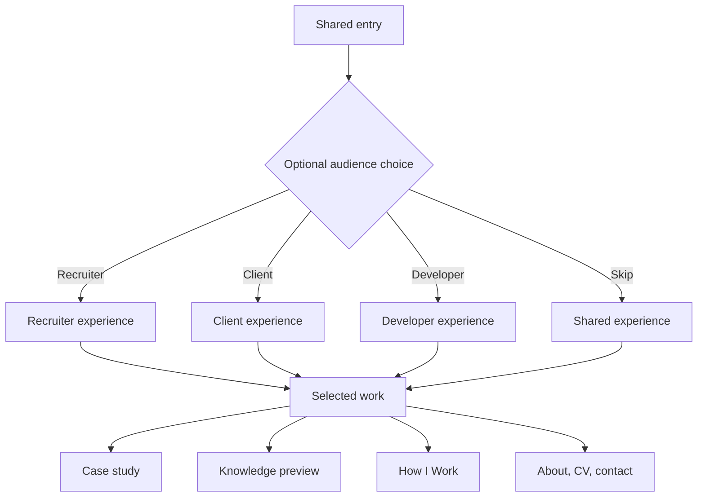

# Experience Architecture

## Entry Model

The homepage opens with a short cinematic introduction, then presents the audience selector.

The introduction:

- Lasts roughly 4-6 seconds.
- Shows Skip immediately.
- Plays once by default and is bypassed for returning visitors unless they choose Replay.
- Uses a reduced-motion alternative when requested.

The long-term selector supports:

- **I’m hiring** leads to the Recruiter experience.
- **I need a solution** leads to the Client experience.
- **I’m here to learn** leads to the Developer experience.
- **Explore everything** enters the shared default experience.

The MVP exposes only **I’m hiring** and **Explore everything**. Client and Developer choices stay hidden until those full experiences ship.

The selector must not block direct links. Shared and Recruiter experiences remain linkable, indexable, and complete. Visitors return to the selector when they want to change journeys.

## Experience Map

## Shared Experience

The shared experience establishes the facts used by all audience modes:

1. Identity and positioning.
2. Optional audience choice.
3. Selected work with role/context labels.
4. Engineering approach.
5. Range: games, cross-platform work, tutorials, and knowledge.
6. About, CV, and contact.

## Recruiter Experience: First Release

The Recruiter experience is the first complete specialized path.

### Order

1. Target role and concise positioning.
2. Proof strip: .NET capabilities, teamwork, shipped project types, and current availability only if verified.
3. Bookify as primary .NET case study.
4. Blood Bank Platform and CinemaVerse as additional .NET/team evidence.
5. BuildSense as product-thinking and adaptability evidence.
6. How to Train Your AI as leadership and creative range.
7. Skills mapped to project evidence.
8. Education and learning system.
9. CV and contact.

### Recruiter rules

- A visitor must understand the role and contribution before opening a repository.
- CV access is never locked behind exploration, a form, or gamification.
- Keep first-pass summaries concise; technical depth remains available inside case studies.
- Give Recruiter a distinct visual world with its own layout, motion language, navigation behavior, and project presentation.
- Reuse the same verified project facts as the shared experience instead of maintaining independent claims.

## Client Experience: Later Phase

Position the offering as custom software solutions:

- Problem discovery and scope shaping.
- .NET backends and APIs.
- Full-stack business applications.
- Authentication, payments, databases, and integrations.
- Automation where it solves a real process problem.

Case studies reorder around business problem, constraints, outcome, and collaboration. Do not promise services or operational capabilities that have not been demonstrated.

## Developer Experience: Later Phase

Prioritize engineering depth and learning:

- Architecture diagrams and boundaries.
- Tradeoffs and ADR-style decisions.
- Selected code excerpts with context.
- Testing and validation strategy.
- Failures and postmortems.
- “How I Work” tutorials and knowledge collections.

## Case-Study Experience

Every case study supports two reading speeds:

- **Fast path:** problem, role, solution, result, evidence.
- **Deep path:** architecture, constraints, decisions, implementation details, validation, and reflection.

Recommended scene order:

1. Project identity and context badge.
2. Problem and intended user.
3. Nour’s role.
4. Visual system overview.
5. One or two key workflows.
6. Engineering challenge and tradeoff.
7. Validation and outcome.
8. Reflection and next improvement.
9. Repository, demo, and next case study.

## MVP Page and Route Model

Language-prefixed routes are required:

| Route pattern                       | Purpose                                                                      |
| ----------------------------------- | ---------------------------------------------------------------------------- |
| `/`                                 | Detect browser language and send the visitor to the matching language entry. |
| `/{lang}`                           | Cinematic introduction and audience selector.                                |
| `/{lang}/explore`                   | Shared engineering-story experience.                                         |
| `/{lang}/recruiter`                 | Distinct Recruiter experience.                                               |
| `/{lang}/projects/{slug}`           | Full shared case study.                                                      |
| `/{lang}/recruiter/projects/{slug}` | Shorter, role-focused Recruiter presentation using the same project facts.   |
| `/{lang}/knowledge`                 | Knowledge preview page.                                                      |
| `/{lang}/about`                     | About, capabilities, education, CV, and contact.                             |

`{lang}` is `en` or `ar`. Main navigation is **Work**, **Knowledge**, and **About**. CV, Contact, language switching, and return-to-selector are actions rather than main navigation sections.

## Language Behavior

- The public site supports English and Arabic.
- Every public URL uses `/en/` or `/ar/`.
- First visit uses browser language to suggest a route, then remembers the visitor’s explicit choice.
- Arabic uses full RTL layout, not translated text inside an LTR shell.
- Audience selection and current reading position should survive language switching when technically feasible.
- Both languages expose equivalent facts, evidence, and calls to action.
- No page launches in only one language. English and Arabic versions ship together with equivalent facts and actions.

## Motion and Interaction

Motion may:

- Explain architecture or data flow.
- Transition between audience worlds.
- Reveal cause and effect inside project stories.
- Give each case study its own visual identity.
- Create memorable but skippable opening moments.

Motion must not:

- Delay access to content.
- hijack scrolling or trap navigation.
- hide essential information behind hover.
- autoplay sound.
- make audience selection mandatory.
- make the mobile experience incomplete.

## Desktop and Mobile

Desktop is the showcase canvas. Mobile is a complete simplified experience.

On mobile:

- Preserve every fact, route, language option, project, CV link, and contact action.
- Replace heavy 3D scenes, pinned sequences, and complex simulations with lighter motion, video, or static diagrams.
- Do not embed large Unity builds by default; use a preview and a supported-platform action.
- Use touch-safe navigation and avoid hover-only meaning.

## Games

The old five-game Arcade is no longer a primary top-level pillar. Games support the range story.

- Feature `How to Train Your AI` as the main creative case study.
- Group course-based Unity games as a collection with clear course context.
- A future playable gallery may use lazy-loaded isolated embeds after build size and browser support are tested.
- Always provide video or image fallback.

## Knowledge and Tutorials

- Portfolio: curated collections and featured tutorials.
- Full knowledge library: embedded or separate product, still undecided.
- Never publish unreviewed private vault content automatically.
- Tutorials use real evidence and disclose AI assistance and validation.

## Gamification

No gamification ships in the MVP. The architecture may leave room for an optional discovery layer later, but no essential content, CV, or contact action may depend on progress, commands, collection mechanics, or rewards.
